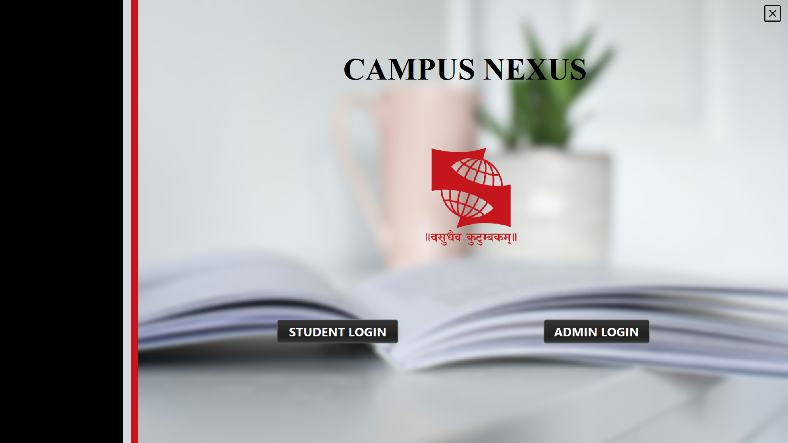

# Campus Nexus - Integrated Student Management System

Welcome to the Integrated Student Management System repository! This project streamlines administrative and academic operations within educational institutions, offering comprehensive solutions for managing various aspects of student and faculty administration.

The software is developed using Java and the NetBeans IDE, and it integrates seamlessly with a MySQL database using JDBC. Additionally, the system leverages Amazon Web Services (AWS) for cloud-based data storage, providing scalability, reliability, and easy accessibility, which enhances the overall efficiency and resilience of the platform. This technology stack ensures efficient data management and supports a dynamic, secure, and functional platform. 

## Table of Contents

- [Introduction](#introduction)
- [Problem Statement](#problem-statement)
- [Modules](#modules)
- [Entities and Attributes](#entities-and-attributes)
- [Relationships](#relationships)
- [Relational Schema](#relational-schema)
- [ER Diagram](#er-diagram)
- [Use Case Diagram](#use-case-diagram)
- [System Architecture](#system-architecture)
- [Technology Stack](#technology-stack)
- [Frontend Sample](#frontend-sample)
- [Contributors](#contributors)

## Introduction

In today’s expanding landscape, it is crucial to have a streamlined and comprehensive approach to managing administrative and academic functions. Our project introduces a Database Management System (DBMS) specifically designed to meet these requirements. The system offers a solution for student management by incorporating key functionalities such as fee management, hostel accommodation, student records, course administration, branch management library management, timetable scheduling, faculty coordination, attendance tracking, and grade management.

To build this software, we utilized Java and the NetBeans (IDE) for a robust and efficient development process. Our system integrates seamlessly with a MySQL database using JDBC, ensuring efficient data storage and retrieval. Additionally, we have leveraged Amazon Web Services (AWS) to provide cloud-based data storage.

This technology stack supports the creation of a dynamic, secure, and highly functional platform that enhances the quality of education delivery and streamlines administrative processes. The inclusion of AWS adds significant benefits, including cloud scalability and resilience, which further enhance the overall efficiency and effectiveness of the system.

## Problem Statement

Educational institutions face challenges in managing their complex academic operations due to the diverse needs of students, faculty, and administration. The current fragmented and manual methods lead to inefficiencies and errors, affecting both management and students. This system provides a unified platform to improve efficiency and enhance the experience for students and staff members.

## Modules

The system includes the following modules:
- **Login Module**: User authentication and access control.
- **Admin Module**: Data management capabilities for various modules.
- **Student Module**: Comprehensive student information management.
- **Fees Module**: Financial aspects of student management.
- **Hostel Module**: Hostel accommodation organization.
- **Timetable Module**: Class schedules management.
- **Attendance Module**: Monitoring and recording attendance data.
- **Faculty Module**: Faculty information management.
- **Grades Module**: Student grades tracking and management.
- **Course Module**: Course catalog management.
- **Library Module**: Library-related data organization.
- **Branch Module**: Branch information management.

### Entities and Attributes

1. **Admin**
    - Attributes:
        - `AdminID` 
        - `Name`
        - `First Name`
        - `Last Name`
        - `Email`

2. **Student**
    - Attributes:
        - `PRN` 
        - `Name`
        - `First Name`
        - `Last Name`
        - `Phone Number`
        - `DOB`
        - `Semester`
        - `Year`
        - `BranchID` 
        - `Email`
        - `Father’s Name`
        - `Address`:
            - `Street`
            - `Street Name`
            - `Street Number`
            - `City`
            - `State`
            - `Zip Code`

3. **Admin Login**
    - Attributes:
        - `AdminID` 
        - `AdminPassword`

4. **Student Login**
    - Attributes:
        - `PRN` 
        - `StudentPassword`

5. **Hostel**
    - Attributes:
        - `PRN` 
        - `Gender`
        - `Simple Room`
        - `Luxury Room`

6. **Course**
    - Attributes:
        - `CourseID` 
        - `Course Name`
        - `Duration`
        - `BranchID` 

7. **Library**
    - Attributes:
        - `LibraryID` 
        - `Category`
        - `Issue`
        - `Return`

8. **Timetable**
    - Attributes:
        - `TimetableID` 
        - `CourseID`
        - `FacultyID`
        - `Room Number`
        - `Timing`

9. **Faculty**
    - Attributes:
        - `FacultyID` 
        - `BranchID`
        - `Faculty Name`

10. **Attendance**
    - Attributes:
        - `PRN` 
        - `Date`
        - `Percentage`

11. **Grades**
    - Attributes:
        - `PRN` 
        - `Midsem`
        - `Endsem`

12. **Fees**
    - Attributes:
        - `PRN` 
        - `Paid/Unpaid`
        - `Fine`

13. **Branch**
    - Attributes:
        - `BranchID` 
        - `Branch Name`

## Relationships

## Relational Schema

The system uses a relational schema to organize data across different entities, ensuring data integrity and consistency in relationships between them.

1. **Admin**
    - **Attributes**: `AdminID`, `Name`, `First Name`, `Last Name`, `Email`
    - **Primary Key**: `AdminID`
    - **Foreign Keys**: None

2. **Student**
    - **Attributes**: `PRN`, `Name`, `First Name`, `Last Name`, `Phone Number`, `DOB`, `Semester`, `Year`, `BranchID`, `Email`, `Father’s Name`, `Address`, `City`, `Zip Code`, `State`, `Street`, `Street Name`, `Street Number`
    - **Primary Key**: `PRN`
    - **Foreign Keys**: `BranchID`

3. **Admin Login**
    - **Attributes**: `AdminID`, `AdminPassword`
    - **Primary Key and Foreign Key**: `AdminID`

4. **Student Login**
    - **Attributes**: `PRN`, `StudentPassword`
    - **Primary Key and Foreign Key**: `PRN`

5. **Hostel**
    - **Attributes**: `PRN`, `Gender`, `Simple Room`, `Luxury Room`
    - **Primary Key and Foreign Key**: `PRN`

6. **Course**
    - **Attributes**: `CourseID`, `Course Name`, `Duration`, `BranchID`
    - **Primary Key**: `CourseID`
    - **Foreign Keys**: `BranchID`

7. **Library**
    - **Attributes**: `LibraryID`, `Category`, `Issue`, `Return`
    - **Primary Key**: `LibraryID`
    - **Foreign Keys**: None

8. **Timetable**
    - **Attributes**: `TimetableID`, `CourseID`, `FacultyID`, `Room Number`, `Timing`
    - **Primary Key**: `TimetableID`
    - **Foreign Keys**: `CourseID`, `FacultyID`

9. **Faculty**
    - **Attributes**: `FacultyID`, `BranchID`, `Faculty Name`
    - **Primary Key**: `FacultyID`
    - **Foreign Keys**: `BranchID`

10. **Attendance**
    - **Attributes**: `PRN`, `Date`, `Percentage`
    - **Primary Key**: `PRN` and `Date`
    - **Foreign Keys**: `PRN`

11. **Grades**
    - **Attributes**: `PRN`, `Midsem`, `Endsem`
    - **Primary Key**: `PRN`
    - **Foreign Keys**: None

12. **Fees**
    - **Attributes**: `PRN`, `Paid/Unpaid`, `Fine`
    - **Primary Key**: `PRN`
    - **Foreign Keys**: None

13. **Branch**
    - **Attributes**: `BranchID`, `Branch Name`
    - **Primary Key**: `BranchID`
    - **Foreign Keys**: None

This relational schema outlines the primary keys, attributes, and foreign keys for each entity, ensuring well-structured and efficient data management across different functional modules of the student management system. 

## ER Diagram

## Use Case Diagram

## System Architecture

## Technology Stack

The Integrated Student Management System is built using a modern and efficient technology stack:

- **Java**: The primary programming language used for developing the software, known for its portability, robustness, and security.

- **NetBeans IDE**: The development environment of choice, offering a range of tools and features to streamline the coding process and enhance productivity.

- **MySQL**: The system utilizes MySQL as the database management system, providing reliable and efficient data storage and retrieval capabilities.

- **JDBC**: Java Database Connectivity (JDBC) is used to seamlessly integrate the Java application with the MySQL database, enabling smooth and efficient data manipulation and access.

- **AWS**: Amazon Web Services (AWS) is used to store data online, offering scalable and secure cloud storage solutions that enhance data accessibility and resilience.

This technology stack ensures a robust, dynamic, and secure system that supports the management of various aspects of student and faculty administration within educational institutions. AWS also adds the benefit of cloud-based data storage, allowing for scalable, reliable, and accessible data management.

## Frontend Sample

## Contributors

- Abhishek Rajput
- Aditya Raj
- Archit Patil
- Arnav Jain

